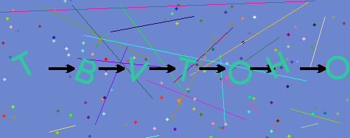
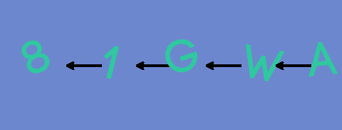

# php-captcha
PHP Captcha library using ttf fonts and gd library

## How to use
1. Download project
2. Copy captcha folder to your project
3. Setup configuration (config.php)
4. Include captchaw.php to your project.
5. Show image to users.
6. Captcha will be in `$_SESSION['captcha']`. Handle it where and like you want.

## Config
* Width
* Height
* Length
* Arrows is random
* Chars for captcha text
* TTF font
* Colors
* On or Off noise

## Example images

